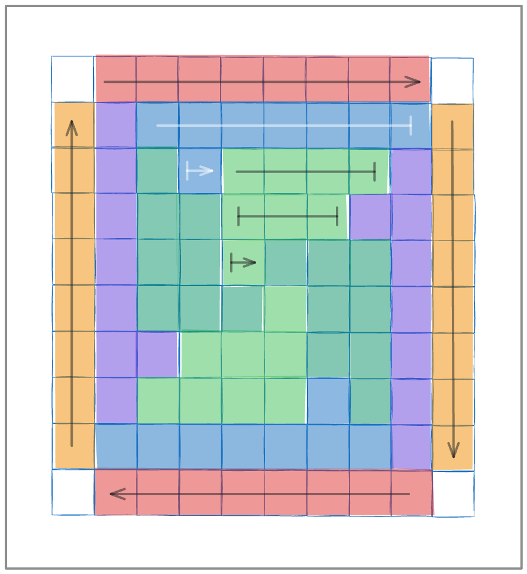

# Shurikode

Shurikode is a 2-dimensional code standard to encapsulate numbers from 0 to 255.

The encoding of shurikode codes is as it follows:



The 8 bit string is inserted 4 times for each of the 3 different levels:

-   **External level** (red and orange): the code is inserted in each side of the code, following a clockwise rotation;
-   **Medium level** (blue and purple): the code is inserted following a clockwise rotation, and the last bit is moved to the beginngin of the new line, but just in this level the code is inverted;
-   **Internal level** (light and dark green): the code is inserted following a clockwise rotation, across the last tree lines.

The squares on the corner are used as parity bits for the external level.

The code is surrounded by a white layer.

## Why?

This code is designed for the really niche use case of extreme visual obfuscation and noise. Using extreme redundancy and shaping the code symmetrically achieves great results in code decoding even under extreme circumnstances.

## How to use it?

### Configuration

To install this package and all of its dependencies use the following command:

```bash
cd Shurikode # Enter in the cloned repository folder
pip install .
```

### Encoder usage

```python
import shurikode

enc = shurikode.enc(size=10) # The size specifies the scale of the image that will be generated.

encoded_number = enc.encode(255) # The result remains inside of the encoder object.

encoded_PIL_image = encoded_number.get_PIL_image() # Returns the corresponding PIL image.

encoded_number.save(path="./") # Saves the encoded image in the specified path.
```

### Decoder usage

```python
import shurikode
from typing import Tuple

dec = shurikode.dec() # Creates the decoder

decoded_value: int = dec(encoded_PIL_image) # Returns the value encoded in the decoded image
```

**NOTE**: the decoder accepts PIL images in RGB format (`Image` type), and PyTorch tensors (`torch.Tensor` type) with both 3 and 4 dimensions.

**IMPORTANT**: no preprocessing is required. The decoder handles it by itself.
